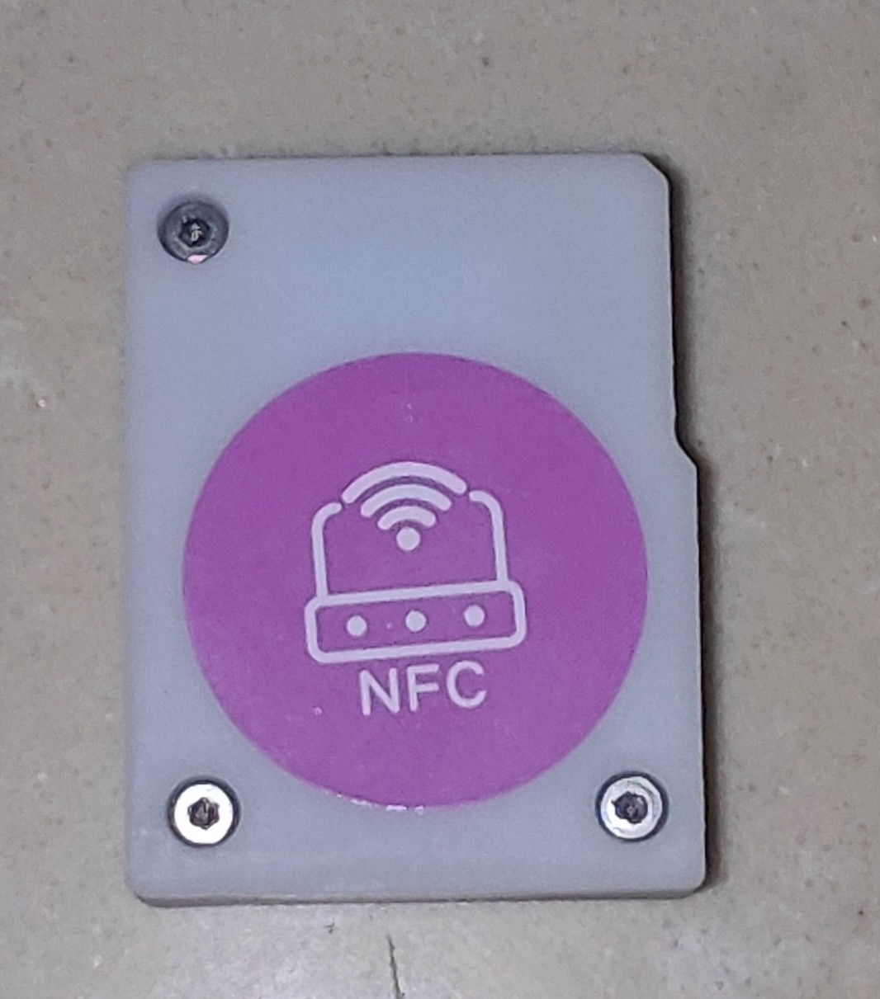
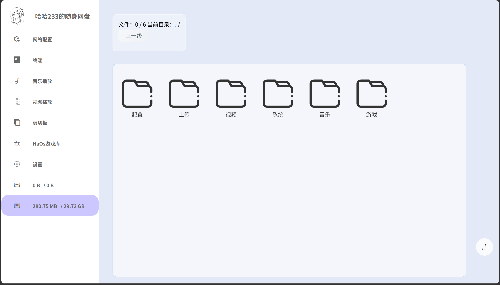
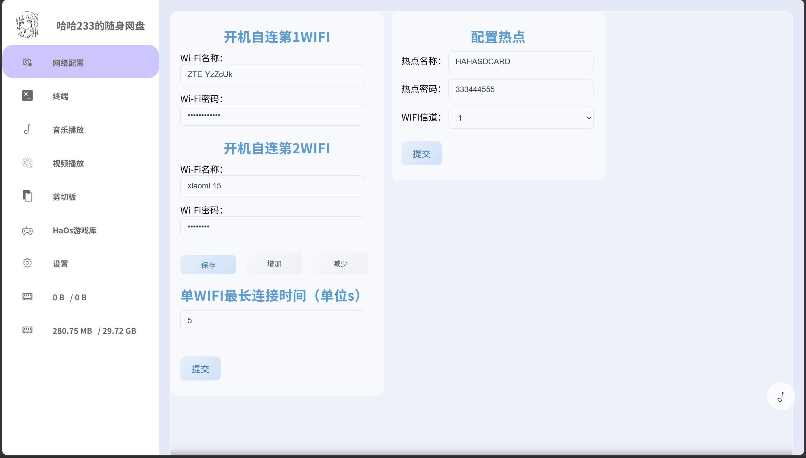
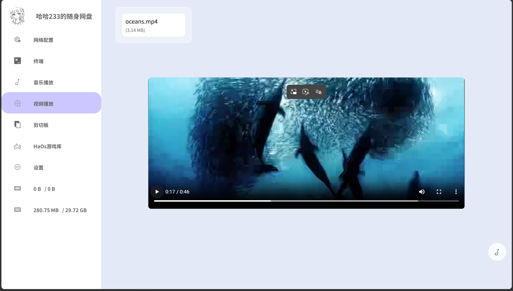
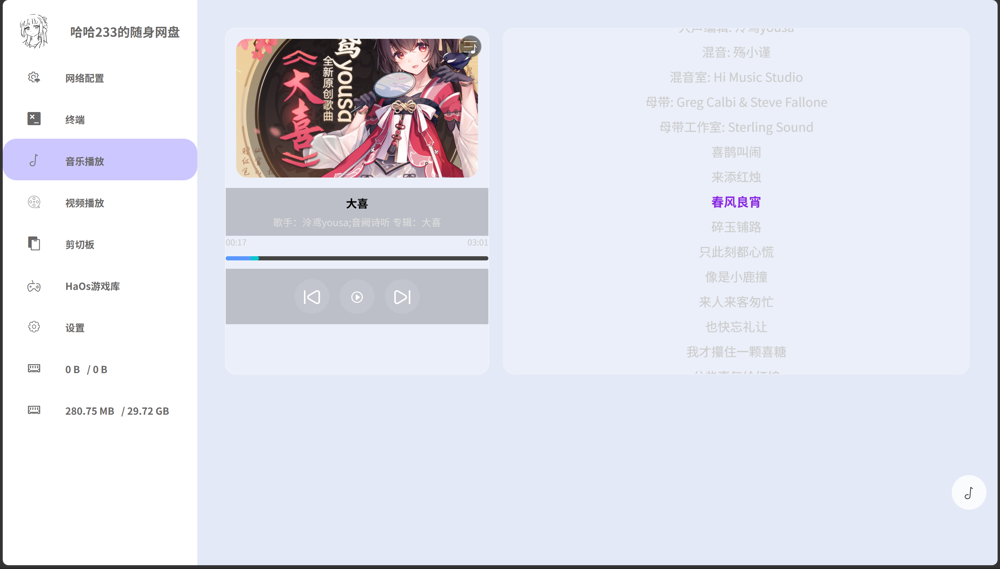
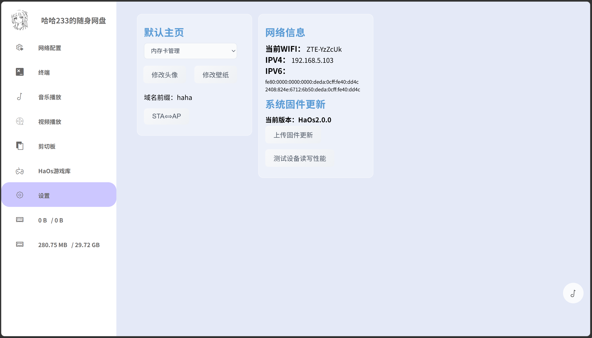
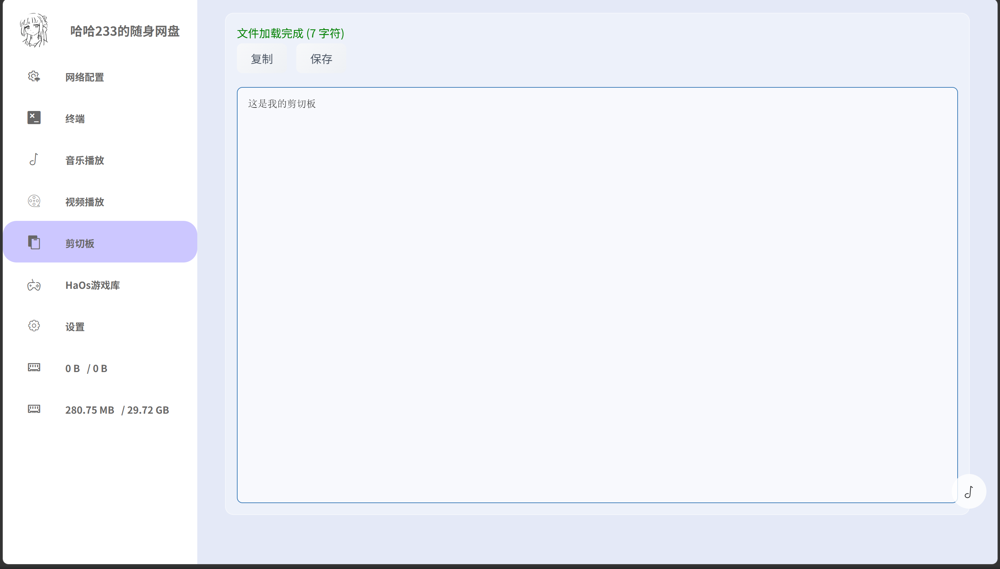
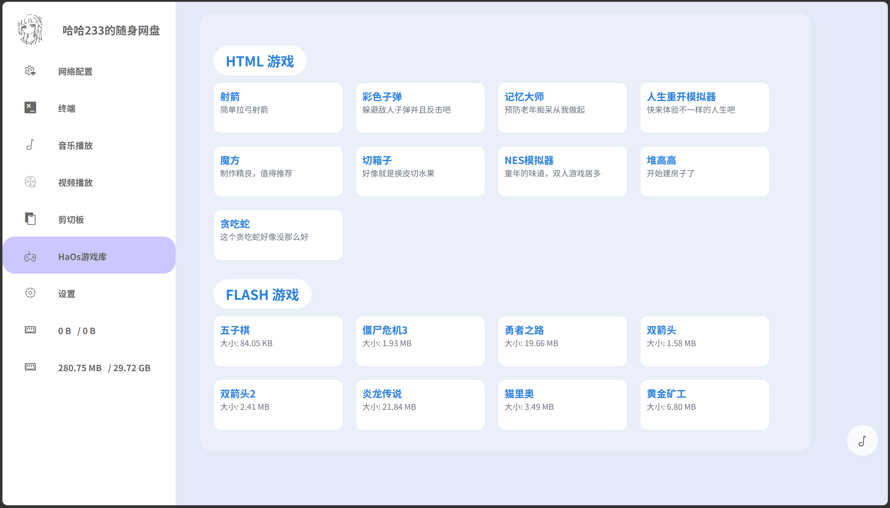
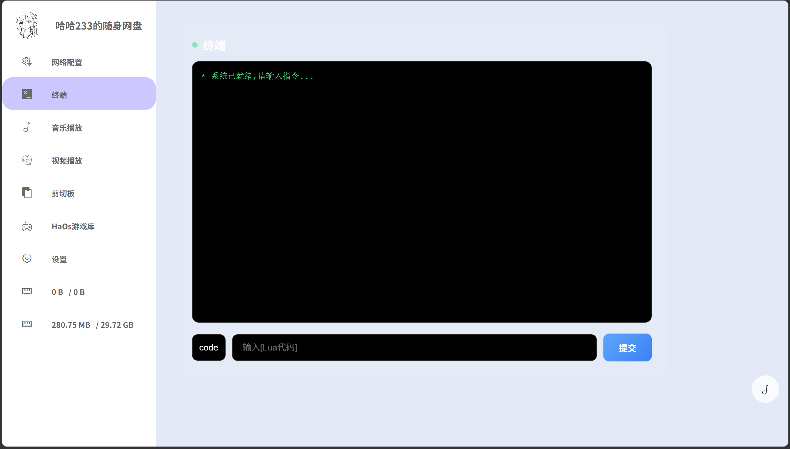

# ESP32S3随身网盘
项目名称：ESP32S3随身网盘

版本：HaOs2.0.0

作者：B站 哈哈233jpg

项目实现文件管理、网络配置、设置、音乐播放、播放视频、剪切板、游戏库、终端运行LUA脚本

成品尺寸:4\*3(3.1)\*1.18cm。

# 相关链接：

哔哩哔哩视频：https://www.bilibili.com/video/BV1zmtN6XE9n/

立创开源广场：https://oshwhub.com/haha233.jpg/esp32-pian-xie-sd-tf-ka-fu-wu-qi_copy_copy_copy

# 个人博客：

https://hehao666.github.io/

# QQ群：933199964

# 使用指南：

ESP-IDF的版本为6.0

ESP32型号：ESP32S3 Flash:4MB 无PSRAM

内存卡数据的config文件夹中的`config.txt`文件`hostName`对应我们的域名前缀，修改这里即可修改后台网址。

~~~
autoWifinum=1
wifiConnectTime=500
hostName=esp32
FirstWebis=1
~~~

# 功能

1、文件总管理

2、网络配置

3、视频播放

4、音乐播放

5、设置

6、剪切板

7、HaOs游戏库

8、H终端

